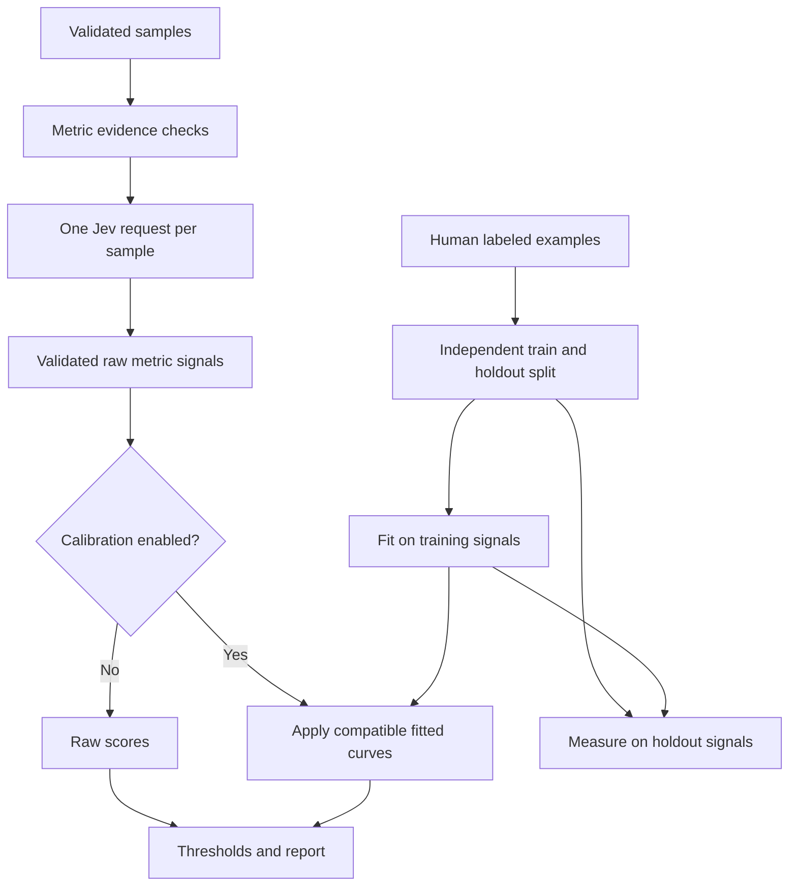

# Architecture and extension contract

The public entry point is `EvaluationPipeline`. It composes an `Evaluator`, a
backend adapter, metric definitions, and an optional `CalibrationBundle`.



## Modules

| Module | Responsibility |
|---|---|
| `data/models.py` | Validated samples, observed tool calls, labels, metric/sample results, summaries |
| `data/datasets.py` | Validated JSON and JSONL interchange |
| `metrics/base.py` | Custom metric model, validation, signal extraction, and reload handling |
| `metrics/rag.py`, `metrics/agents.py` | Built-in response, RAG, agent, and policy rubrics |
| `metrics/registry.py`, `metrics/presets.py` | CLI metric registry and fixed evaluation panels |
| `backends/jev.py` | Official SDK adapter and backend/session protocols |
| `evaluation/evaluator.py` | Preflight, fixed worker pool, per-sample batching, error policy, aggregation |
| `evaluation/pipeline.py` | Opt-in lifecycle, independent split, fitting, save/load, automated run |
| `evaluation/decorators.py` | Sync/async decorators preserving native outputs |
| `calibration/core.py` | Isotonic fitting, portable prediction, diagnostics, validated artifacts |
| `runtime/guards.py` | Named execution checkpoints, decision policies, tool dispatch gates, response metadata |
| `runtime/agents.py` | Framework-independent agent decorators, entrypoint discovery, and instance proxies |
| `runtime/tools.py` | Shared tool-argument snapshots, evidence mapping, and guarded execution |
| `adapters/` | LangChain, CrewAI, and Microsoft Agent Framework tool registration and runtime mapping |
| `cli.py` | Dataset evaluation, calibration fitting, and CI gate exit codes |

These paths are relative to `typed_evals/`. Each subpackage exposes its public
objects through `__init__.py`; the root package continues to export the existing
public API. For example, `typed_evals.metrics.Metric` and
`typed_evals.evaluation.Evaluator` are available alongside their root imports.
Direct implementation imports moved with the files: use
`typed_evals.data.models` instead of `typed_evals.models`,
`typed_evals.backends` instead of `typed_evals.backend`, and
`typed_evals.evaluation.evaluator` instead of `typed_evals.evaluator`.

Importing the core package or an adapter module does not import an agent framework.
The CrewAI decorator loads CrewAI when creating a native tool. The LangChain and
Microsoft adapters operate on the runtime objects injected by their frameworks.
See the [adapter guide](ADAPTERS.md) for the integration contracts.

## Backend interface

Custom backends implement `model: str` and `session()`, an asynchronous context
manager yielding a `JudgeSession`. The session implements:

```python
async def judge(state: dict, questions: Mapping[str, Question]) -> JudgeResponse: ...
```

`Question` is an official SDK Noul, Choice, or Score object. `JudgeResponse`
contains the actual model ID, typed-answer dictionaries, and optional usage.
The fake backend in `examples/offline_demo.py` demonstrates the contract.

`JevBackend(client=existing_async_client)` allows custom transports, endpoints,
or caller-owned SDK configuration. The caller closes that client. Its timeout
and retry settings supersede `JevBackend.timeout` / `max_retries`; the adapter
still passes its explicit `model` on each request. Use a supplied async client
inside its owning event loop.

Without an injected client, each evaluation batch creates and closes a pooled
client, including on exceptions or cancellation. Sync entry points use
`asyncio.run`. When the calling thread already has a running event loop (for
example, in a notebook), they use a worker thread with a separate loop and a copy
of the caller's context variables. The worker and its loop are closed after each
call, including when evaluation raises. These calls still block the caller;
await the async APIs to keep notebook/server event loops responsive. Supplied
async clients and custom backends with resources tied to a loop must use the
async APIs in their owning loop.

## Behavior under failures

- All sample input checks occur before the first request in an evaluation batch.
- A missing required evidence field raises by default. Explicit skips have no score.
- The official SDK owns retries for transient errors; permanent bad requests and
  authentication errors are not retried by the framework.
- API failures raise by default. `errors="record"` records the exception type
  without copying provider response bodies into exported reports.
- Partial response omissions are validated metric by metric. Invalid/missing
  answers never become zero, an empty success, or a synthetic confidence value.
- If a worker raises, the remaining workers are cancelled and awaited before
  closing the client. Already-sent requests may still have been billed.
- Calibration mismatch is always fatal, including in record-errors mode.
- A failed refit leaves the last successfully fitted calibration bundle intact.

## Performance and intentional boundaries

Question construction happens once per batch. Questions sharing a sample share
one request, one state, and one usage record. Fixed workers bound in-flight requests
and task overhead. Report memory is O(number of samples × number of metrics);
the API returns a materialized report. Process very large datasets in batches
with `evaluate`, reusing the saved calibration bundle.

Only the union of fields required by active metrics is sent to Jev. Unrelated
metadata and labels are excluded. Raw responses are supplied to TypeSafe for
evaluation; they are not redacted automatically. No execution logs, cache files,
or raw response text are persisted by default. Saved calibration artifacts contain
knots, metrics, model IDs, diagnostics, and hashes, not raw training text.

The metric registry supports all three Jev primitives. It does not generate claims,
explanations, or chain-of-thought with another LLM. It does not reimplement framework
callbacks or orchestrate an agent. `RuntimeGuard` can invoke an explicitly supplied
operation/tool once after its checkpoint permits it, and gate materialized output
before delivery. It never automatically retries application actions. Proposals
are separate from observed tool events. See the [runtime contract](RUNTIME.md)
for policy, failure, concurrency, and framework-adapter semantics.
It does not claim numeric equality with existing
Ragas/DeepEval metrics. Integrate native outputs through explicit sample mappings.
