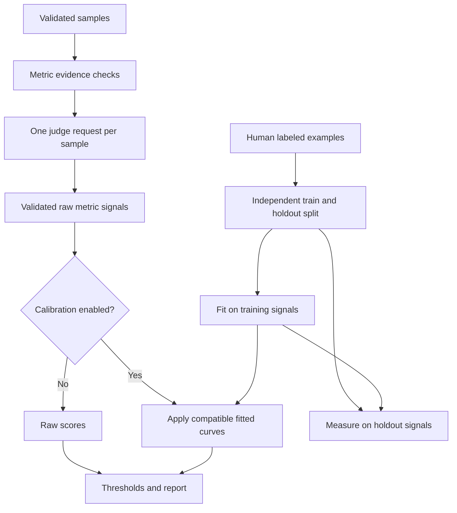

# Architecture and extension contract

The convenience entry points are `evaluate` and `aevaluate`. `Evaluator` owns a
metric panel and backend; `EvaluationPipeline` adds optional calibration using a
`CalibrationBundle`.

Three adapters are bundled: `JevBackend` (default), `OpenAIDecisionsBackend`
(optional `openai` extra), and `SystemOneBackend` for deployed Jev-compatible
servers, including Clef, Laya, and Strands Decider. `JevBackend` also supports
TypeSafe-compatible hosted endpoints, such as Microsoft Decision-1 on OpenRouter.
Custom adapters implement the same backend protocol. Evaluation and runtime guards
remain provider independent.


```mermaid
flowchart TD
    A[Validated samples] --> B[Metric evidence checks]
    B --> C[One judge request per sample]
    C --> D[Validated raw metric signals]
    D --> E{Calibration enabled?}
    E -->|No| F[Raw scores]
    E -->|Yes| G[Apply compatible fitted curves]
    F --> H[Thresholds and report]
    G --> H
    L[Human labeled examples] --> S[Independent train and holdout split]
    S --> T[Fit on training signals]
    S --> V[Measure on holdout signals]
    T --> V
    T --> G
```

## Modules

| Module | Responsibility |
|---|---|
| `data/models.py` | Validated samples and image inputs, observed tool calls, labels, metric/sample results, summaries |
| `data/datasets.py` | Validated JSON and JSONL interchange |
| `metrics/base.py` | Custom metric model, validation, signal extraction, and reload handling |
| `metrics/rag.py`, `metrics/agents.py` | Built-in response, RAG, agent, and policy rubrics |
| `metrics/registry.py`, `metrics/presets.py` | CLI metric registry and fixed evaluation panels |
| `backends/jev.py` | Official SDK adapter and backend/session protocols |
| `backends/openai_decisions.py` | Native Decisions compilation, strict answer validation, and flat usage conversion |
| `backends/systemone.py` | HTTP adapter for deployed System One servers, optional authentication, retries, and flat usage conversion |
| `evaluation/evaluator.py` | Preflight, fixed worker pool, per-sample batching, error policy, aggregation |
| `evaluation/pipeline.py` | Opt-in lifecycle, independent split, fitting, save/load, automated run |
| `evaluation/decorators.py` | Sync/async decorators preserving native outputs |
| `calibration/core.py` | Venn–Abers/isotonic fitting, portable prediction, diagnostics, validated artifacts |
| `runtime/guards.py` | Named execution checkpoints, decision policies, tool dispatch gates, response metadata |
| `runtime/agents.py` | Framework-independent agent decorators, entrypoint discovery, and instance proxies |
| `runtime/tools.py` | Shared tool-argument snapshots, evidence mapping, and guarded execution |
| `adapters/` | LangChain, CrewAI, and Microsoft Agent Framework tool registration and runtime mapping |
| `cli.py` | Dataset evaluation, calibration fitting, and CI gate exit codes |

These paths are relative to `typed_evals/`. Each subpackage exposes its public
objects through `__init__.py`; the root package continues to export the existing
public API. For example, `typed_evals.metrics.Metric` and
`typed_evals.evaluation.Evaluator` are available alongside their root imports.
See the [changelog](../CHANGELOG.md) for direct implementation import migrations.

Importing the core package or an adapter module does not import an agent framework.
It does not import OpenAI either; the optional SDK loads when Decisions is used.
The CrewAI decorator loads CrewAI when creating a native tool. The LangChain and
Microsoft adapters operate on the runtime objects injected by their frameworks.
See the [adapter guide](ADAPTERS.md) for the integration contracts.

## Backend interface

Custom backends implement `model: str` and `session()`, an asynchronous context
manager yielding a `JudgeSession`. The session implements:

```python
async def judge(state: dict, questions: Mapping[str, Question]) -> JudgeResponse: ...
```

`Question` is a TypeSafe SDK Noul, Choice, or Score object. `JudgeResponse`
contains the actual model ID, typed-answer dictionaries, and optional usage.
The core `typesafe-sdk` dependency is required for metric construction even when
the chosen backend uses another provider. Pass a custom backend as `backend=` to
evaluation entry points or runtime guards. The fake backend in
[`examples/offline_demo.py`](../examples/offline_demo.py) demonstrates the contract.

TypeSafe-compatible hosted models use `JevBackend` directly with `model`,
`base_url`, and `api_key`. For Microsoft Decision-1 on OpenRouter, set
`model="microsoft/microsoft-decision-1"` and
`base_url="https://openrouter.ai/api"` with an OpenRouter API key. The TypeSafe
SDK appends `/v1/systemone` and handles the existing typed question/answer
protocol, so this configuration needs no custom adapter. See the
[hosted-model guide](EVALUATION.md#hosted-typesafe-compatible-models) and
[OpenRouter example](../examples/openrouter_decisions.py).

`SystemOneBackend(model=..., base_url=..., api_key=None)` sends the same typed
question schemas to `/v1/systemone` through an async HTTP client. The required
`base_url` is an API root; path prefixes are preserved before `/v1/systemone` is
appended. Credentials are explicit, so a keyless server needs no TypeSafe API key
or environment configuration. The adapter retains the server's model and typed
answers, and ignores non-counter usage metadata. See the
[open-model guide](EVALUATION.md#open-and-self-hosted-system-one-models) and
[runnable example](../examples/systemone_decisions.py).

Image support is an optional backend capability:

```python
supported_modalities = frozenset({"text", "image"})
```

Backends without `supported_modalities` are treated as text-capable, preserving the
existing protocol. Decisions advertises text and image support; Jev and System One
currently advertise text only. The evaluator checks selected modalities before
opening a session. An optional `validate_state(state)` hook lets a backend preflight its
provider-specific limits across the whole batch before any requests. Unselected
images do not affect text requests or require an image-capable backend.

Images live in the shared `EvaluationSample.images` field as validated
`ImageInput(data_url=..., detail=..., label=...)` objects. The selected evidence
state contains their ordered JSON-compatible representation. An image-capable
adapter translates that state into its own wire format and applies its own limits.
A future Jev adapter can advertise image support and translate this same state;
sample construction, `Metric.required_fields`, and evaluation entry points remain
the same. Built-in metrics and presets retain their existing required fields.

`JevBackend(client=existing_async_client)` and
`OpenAIDecisionsBackend(client=existing_async_openai_client)` allow custom
transports, endpoints, or caller-owned SDK configuration. The caller closes that
client. Its timeout and retry settings supersede the backend's `timeout` /
`max_retries`; each adapter still passes its explicit `model` on every request.
`SystemOneBackend(client=existing_async_http_client, model=..., base_url=...)`
also leaves its injected client open; its adapter owns request retries and uses
the supplied client's timeout configuration.
Use a supplied async client inside its owning event loop. Jev remains the default;
Decisions defaults to `gpt-6-luna` and requires `typed-evals[openai]`.

Without an injected client, each evaluation batch creates and closes a pooled
client, including on exceptions or cancellation. Sync entry points use
`asyncio.run`. When the calling thread already has a running event loop (for
example, in a notebook), they use a worker thread with a separate loop and a copy
of the caller's context variables. The worker and its loop are closed after each
call, including when evaluation raises. These calls still block the caller;
await the async APIs to keep notebook/server event loops responsive. Supplied
async clients and custom backends with resources tied to a loop must use the
async APIs in their owning loop.

### Native Decisions translation

Decisions uses the official OpenAI Python SDK `>=3.26.0,<4` and its dedicated
`await client.decisions.create(...)` endpoint, `POST /v1/decisions`. The adapter
uses the SDK's `with_raw_response.create(...)` wrapper to validate original JSON
before SDK model coercion, retaining the same transport and retries. It
serializes only the supplied evidence state deterministically, preserving Unicode,
structured tool evidence, and complete instructions without truncation. It compiles
all active questions into one request with unique metric names:

| Metric primitive | Decisions question | Raw metric signal |
|---|---|---|
| Noul | Predicate; policy and true/false descriptions are included in instructions | Probability of the positive condition |
| Choice | Original string keys and descriptions in deterministic choice order, 2–255 choices | Sum of probabilities of `pass_options` |
| Score | Declared level order, stable stringified ordinal labels, original descriptions | Expected ordinal divided once by `number_of_levels - 1` |

The backend returns the expected ordinal Score unchanged to the existing metric
parser, which performs the sole normalization. Duplicate descriptions retain
distinct ordinal labels. Strings such as `"true"` and `"false"` remain strings.
Response association uses question names; duplicate, unexpected, or untrustworthy
associations fail the request. Independently attributable answer errors and
refusals can be recorded per metric. Distributions are validated before conversion
to dictionaries, so duplicates and malformed wire values cannot disappear through
coercion. Nested SDK usage is flattened into scalar counters. The response's actual
model ID is retained.

For image-selected state, Decisions builds one user message containing an
`input_text` part for the JSON evidence followed by ordered `input_image` parts.
The text identifies image positions and optional labels; base64 image data appears
only in the native image parts. Image detail is preserved. The shared schema
accepts inline PNG, JPEG, WebP, and GIF data URLs; Decisions validates its limit of
128 selected images. Text-only state retains its existing request format.

Calibration provenance is an optional backend capability, separate from the
`Backend` protocol. Bundled adapters identify their provider, backend, compiler
version, and ordered static question configuration; Decisions and System One also record the
effective endpoint (without URL userinfo, query, or fragment). The pipeline
fingerprints that configuration without sample evidence, thresholds, credentials,
or transport settings. Caller-owned clients with additional custom routing
behavior must keep that behavior stable for a fitted curve. A third-party backend
implementing only `model` and `session()` remains
usable and produces an explicit unknown-provenance v3 artifact. See
[version compatibility](CALIBRATION.md#artifact-versions-and-compatibility).

Selecting images uses multimodal compiler provenance and metric fingerprint
schema version 3. Text-only panels preserve their established compiler and metric
fingerprints. Sample overlap hashes include selected image content, order, detail,
and labels, while provenance and saved reports contain no raw image bytes.

## Behavior under failures

- All sample input checks occur before the first request in an evaluation batch.
- A missing required evidence field raises by default. Explicit skips have no score.
- Supplied contexts excluded by all active metrics produce one warning per batch,
  after input validation and before the backend session opens.
- Jev and Decisions use their SDK retries; System One retries transient HTTP and
  transport failures. Permanent bad requests and authentication errors are not retried.
- API failures raise by default. `errors="record"` records the exception type
  without copying provider response bodies into exported reports.
- Decisions SDK transport failures become `OpenAIDecisionsError` after SDK
  retries, with a safe type-only message and suppressed provider exception chain.
  A per-question refusal uses `DecisionRefusalError`, a subclass of
  `InvalidAnswerError`; refusal contents are withheld.
- System One transport failures become `SystemOneError` with only the HTTP
  status or transport exception type. Invalid or missing answers are unavailable
  per metric; unknown answer names and duplicate JSON fields fail the request.
- Jev partial response omissions are validated metric by metric. Decisions
  missing, duplicate, or unexpected question names fail the entire request;
  attributable malformed answers and refusals are handled per metric. Unavailable
  answers never become zero, an empty success, or a synthetic confidence value.
- Decisions refusals are unavailable judgments. Recording one preserves successful
  sibling metrics and leaves the sample's overall pass status unavailable.
- If a worker raises, the remaining workers are cancelled and awaited before
  closing the client. Already-sent requests may still have been billed.
- Calibration mismatch is always fatal, including in record-errors mode.
- A failed refit leaves the last successfully fitted calibration bundle intact.

## Performance and intentional boundaries

Question construction happens once per batch. Questions sharing a sample share
one request, one state, and one usage record. Fixed workers bound in-flight requests
and task overhead. Report memory is O(number of samples × number of metrics);
the API returns a materialized report. Process very large datasets in batches
with `evaluate`, reusing the saved calibration bundle.

Only the union of fields required by active metrics is sent to the selected judge.
Unrelated metadata and labels are excluded. Raw evidence is supplied to the
selected provider for evaluation; it is not redacted automatically. No execution logs, cache files,
or raw response text are persisted by default. Saved calibration artifacts contain
knots, metrics, model IDs, diagnostics, and hashes, not raw training text.

The metric registry supports Noul, Choice, and Score through both bundled providers.
It does not generate claims,
explanations, or chain-of-thought with another LLM. It does not reimplement framework
callbacks or orchestrate an agent. `RuntimeGuard` can invoke an explicitly supplied
operation/tool once after its checkpoint permits it, and gate materialized output
before delivery. It never automatically retries application actions. Proposals
are separate from observed tool events. See the [runtime contract](RUNTIME.md)
for policy, failure, concurrency, and framework-adapter semantics.
Runtime audit data uses `metadata["typed_evals"]`; the legacy `metadata["jev"]`
alias remains available with the same payload for existing consumers.
It does not claim numeric equality with existing
Ragas/DeepEval metrics. Integrate native outputs through explicit sample mappings.
