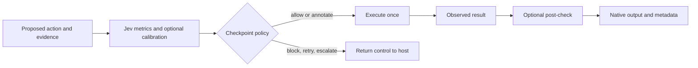

# Evaluation inside agent execution

`RuntimeGuard` runs Jev at checkpoints chosen by your application. A checkpoint
maps to a `GuardPolicy`, which accepts either an `Evaluator` or a fitted
`EvaluationPipeline`. It uses the same custom metrics, evidence validation,
thresholds, backend configuration, and optional calibration as offline evaluation.
There are no agent-framework dependencies and no implicit global hooks.

For one tool, start with [Guard a Python tool](#guard-a-python-tool) or the
[LangChain adapter](#langchain-tools). For custom metric panels, calibrated scores,
or several checkpoints, use the explicit APIs further below.

## Guard a Python tool

```python
from typed_evals import guard_tool


@guard_tool(
    policy="Only read tickets owned by Alice.",
    input="Read my ticket T-42.",
    contexts=["Authenticated customer: Alice. Alice owns T-42."],
)
def read_ticket(ticket_id: str) -> str:
    """Read a support ticket's complete text."""
    return ticket_store.read_authorized("Alice", ticket_id)


text = read_ticket("T-42")
```

`ticket_store` represents your application's service. Register the decorated
function with your framework. `input` and `contexts` can also be synchronous
callbacks receiving a mapping of the tool's bound arguments, including defaults.
These callbacks should use the application's authenticated request context to
provide current facts; model-supplied claims of authorization are not evidence.

The helper builds a `ToolSafety(policy=..., threshold=0.9)` evaluator and a
`before_tool` checkpoint. It captures the function name, signature/docstring,
JSON arguments, and a unique invocation ID. `contexts` must contain at least one
nonblank application-owned evidence string. A missing answer is represented
internally; users do not construct an empty response or a proposal object.

Sync and async functions preserve their signature and native output. Arguments
are copied before evidence mapping and judgment; execution receives the reviewed
JSON values. Invalid arguments, evidence mapper errors, and non-JSON tool inputs
raise before execution. Variadic functions require the advanced `guarded_by` API.
Injected framework objects need an adapter, such as the one below.

`on_fail="block"` and `on_error="block"` raise `GuardrailViolation` before execution.
Optional `threshold`, `backend`, `timeout`, `on_fail`, and `on_error` configure the
same policies as `RuntimeGuard`. Tool exceptions propagate without retries.
Successful calls return native output; an enclosing `guarded_agent` or `guarded_by`
wrapper collects decisions, including unique sample IDs, in its metadata. For
standalone decision objects, use `RuntimeGuard.call_tool`.

## LangChain tools

Install `pip install '.[langchain]'`. Apply this adapter **under** `@tool`:

```python
from langchain.tools import ToolRuntime, tool
from typed_evals.adapters.langchain import guard_tool


@tool
@guard_tool(
    policy="Only read tickets owned by the authenticated customer.",
    contexts=lambda runtime: runtime.context["authorization_evidence"],
)
def read_ticket(ticket_id: str, runtime: ToolRuntime) -> str:
    """Read the complete text of a support ticket."""
    return ticket_store.read_authorized(runtime.context["customer_id"], ticket_id)
```

The `runtime: ToolRuntime` parameter uses LangChain's
[runtime injection](https://reference.langchain.com/python/langgraph.prebuilt/tool_node/ToolRuntime).
The adapter preserves the annotation so LangChain excludes it from the model's
tool schema. Jev receives the latest human message's text, the tool's public
arguments and description, and your explicitly supplied evidence. It does not
automatically receive runtime state, configuration, or credentials.

`contexts` accepts fixed strings or a synchronous callback of `ToolRuntime`.
Pass current application-owned facts using LangChain's runtime context when
invoking the agent. The supplied tool call ID becomes the result's `sample_id`;
if absent, a unique ID is generated. For `@tool("custom_name")`, also set
`guard_tool(name="custom_name", ...)` to record the registered name accurately.

String messages and lists of text blocks are supported. Missing, empty, or
multimodal human requests raise instead of substituting an older request or
silently discarding evidence. Other state/message formats, additional injected
arguments, or custom evaluation panels can use `guarded_by` with an explicit mapper.
The latest request is intentionally the input; add any relevant prior facts to
your evidence. See [the complete runnable example](../examples/langchain_guarded_tools.py).

### CrewAI and Microsoft Agent Framework tools

Use `typed_evals.adapters.crewai.guard_tool` to create a native CrewAI tool, or
`typed_evals.adapters.agent_framework.guard_tool` under Microsoft's `@tool` for
functions that accept an injected `FunctionInvocationContext`. Both share the
same argument snapshots and runtime enforcement described above. The
[adapter guide](ADAPTERS.md) covers installation, examples, cache behavior, and
how each framework reports a blocked tool call.

## Advanced checkpoints



Run the complete example without credentials:

```bash
python examples/runtime_guardrails.py
# Billable real judgments, using TYPESAFE_API_KEY:
python examples/runtime_guardrails.py --live
```

The offline example uses synthetic fixture scores to demonstrate execution
control. It does not measure Jev's classification accuracy.

### Notebook imports after updating package code

If a nonempty list of `ToolSafety(...)` / `ToolAccuracy(...)` raises
`ValueError: metrics must contain at least one Metric`, restart the notebook kernel
and rerun the imports and guard construction. Older evaluator versions use a class
identity check that can fail after partial module reloads or loading the package
under multiple import names. Use the root-level package consistently:

```python
from typed_evals import Evaluator, GuardPolicy, RuntimeGuard, ToolAccuracy, ToolSafety
```

The current evaluator revalidates base metric instances from another reload or
import alias of the same source file. Invalid entries now identify their list
index and type. Restarting is still needed to load updated code already cached in
a running kernel, and to refresh custom metric subclasses after reloading modules.

## Guard tool dispatch before execution

```python
from typed_evals import (
    EvaluationSample,
    Evaluator,
    GuardPolicy,
    GuardrailViolation,
    RuntimeGuard,
    ToolAccuracy,
    ToolProposal,
    ToolSafety,
)

guard = RuntimeGuard(
    {
        "before_tool": GuardPolicy(
            Evaluator(
                [
                    ToolSafety(policy="Only read tickets belonging to the authenticated customer."),
                    ToolAccuracy(threshold=0.85),
                ]
            ),
            timeout=10,
        ),
    }
)


def read_ticket(ticket_id):
    return {"id": ticket_id, "refund_period": "30 days"}


sample = EvaluationSample(
    id="call_001",  # Use a unique ID for each tool invocation.
    input="Read ticket T-42.",
    response="",  # No answer has been generated at this boundary.
    proposed_tool_call=ToolProposal(name="read_ticket", arguments={"ticket_id": "T-42"}),
    contexts=(
        "read_ticket(ticket_id: str) reads an existing ticket without modifying it.",
        "The authenticated customer owns T-42 and is authorized to read it.",
    ),
)

try:
    result = guard.call_tool({"read_ticket": read_ticket}, sample)
    tool_output = result.output
    audit_metadata = result.metadata
    tool_name = audit_metadata["jev"]["decisions"][0]["evaluation"]["tool_name"]
except GuardrailViolation as exc:
    decision = exc.decision.to_dict()
    # No tool was dispatched. Return a refusal, request revised arguments,
    # or route an escalation through your application's approval flow.
```

Use `await guard.acall_tool(...)` in an async agent loop. Async tools run in the
current loop; sync tools run in a worker thread. Tools must accept keyword
arguments. Registry lookup and Python signature binding happen before judgment.
Annotations on Python function parameters are not runtime type validation; enforce
tool schemas and access controls in your dispatcher as well.

`call_tool` snapshots the selected callable and nested JSON arguments before
awaiting Jev. Mutating the original proposal or registry during evaluation cannot
change that dispatch. Supply current, application-owned tool specifications,
authorization facts, and known argument values as evidence. The tool must still
enforce authorization against current state when it executes; a judgment is not
an authorization token and cannot prevent external state changes.

`ToolProposal` has no output/status fields. `ToolCall` remains an observed event.
For an optional post-check, configure another checkpoint and pass
`after="after_tool"`. Its sample includes the new observed event in `trace` and
clears `proposed_tool_call`. Non-JSON native tool outputs need an explicit
`output_mapper`, for example `lambda output: {"id": output.id}`. The returned
native output is preserved. `status="success"` means the callable returned;
whether it achieved the business objective is assessed from the actual output.

Before-tool evaluation metadata includes `tool_name` from the proposal and
`sample_id` from `EvaluationSample.id`. Use a unique sample ID for each invocation
to distinguish repeated calls to the same tool. `tool_name` identifies a proposal
even when the judgment denies it; it does not establish execution. Evaluations
without a proposal, including the post-check above, have `tool_name=None`. A trace
can contain several tools, so it does not supply a single result-level tool name.

A post-check withholds a result from its consumer; it cannot undo effects of the
tool that already ran. Tool exceptions propagate unchanged, and tools are never
retried automatically. Catch failures in the host and map actual error events to
an error/recovery checkpoint if needed.

## Annotate or withhold responses

```python
from typed_evals import Faithfulness

response_guard = RuntimeGuard(
    {
        "after_response": GuardPolicy(
            Evaluator([Faithfulness(threshold=0.8)]),
            on_fail="annotate",
        ),
    }
)

native = {"answer": "The refund period is 90 days."}
response = response_guard.respond(
    "after_response",
    EvaluationSample(
        input="What is the refund period?",
        response=native["answer"],
        contexts=("The refund period is 30 days.",),
    ),
    native,
)
print(response.output)  # The exact native object.
print(response.metadata["jev"]["hallucination_suspected"])
```

`hallucination_suspected` is `True` when Jev fails `faithfulness` or
`tool_grounding` at the configured threshold, `False` when the evaluated grounding
checks pass, and `None` when no grounding check yields a usable conclusion.
It is a judge's evidence-relative finding, not an independent determination of
truth. Missing evidence is never reported as a clean grounding result. Other
custom metric failures appear under `failed_metrics`; they do not implicitly
acquire hallucination semantics.

Each decision records its checkpoint, unique ID, action, failed/unavailable
metrics, per-metric raw and calibrated scores, thresholds, observed judge model,
usage, sample hash, and evaluation duration where available. Provider exceptions
are recorded by type, without their potentially sensitive message bodies. The
guard stores no shared history; accumulate `result.decisions` in your own run
record. Neither evidence nor native output is automatically persisted.

`respond`/`arespond` evaluate an already materialized result before releasing it.
The sample must describe that exact result. Merge `response.metadata` into your
framework's metadata container if desired. The wrapper never modifies the native
response. Choose `on_fail="block"` to withhold hallucination-suspect responses,
or `"retry"` to let the host regenerate and recheck them.

## Policy and failure semantics

| Action | May execution/delivery proceed? | Host behavior |
|---|---|---|
| `allow` | Yes | All checked metrics passed; generated by the guard |
| `annotate` | Yes | Retain findings in metadata |
| `block` | No | Stop this action or withhold this output |
| `retry` | No | Revise the proposal/output, then run the checkpoint again |
| `escalate` | No | Route the decision to an application-owned approval flow |

`on_fail` and `on_error` default to `block`. Errors include judge exceptions,
timeouts, skipped evidence, and unusable results. Annotation of an error requires
an explicit `on_error="annotate"`; this permits an unevaluated result and retains
the error in metadata. Calibration configuration/drift errors always propagate,
even with annotation enabled. Cancellation propagates as cancellation.

`metric_actions={"answer_relevancy": "retry", "faithfulness": "block"}` overrides
`on_fail` per metric. Conflicting actions use the priority
`block > escalate > retry > annotate > allow`; an unavailable metric contributes
`on_error`. Unknown metric overrides and unconfigured checkpoint names raise.
Custom metrics must use the existing convention that higher scores mean better
compliance. A risk metric should score the probability of **absence** of the risk,
or use Choice `pass_options` to define its acceptable outcomes.

`check`/`acheck` only return decisions: framework middleware must call
`decision.require_allowed()` before invoking its continuation. `enforce`/
`aenforce`, `run`/`arun`, `call_tool`/`acall_tool`, `respond`/`arespond`, and
`guarded_by` enforce automatically, raising `GuardrailViolation` for any action
that cannot continue. The exception carries the failing `decision`.

`timeout` bounds the async judgment, including evaluator retries, subject to
cooperative cancellation. It does not bound tool execution. Once a tool starts,
especially a synchronous tool in a worker, cancelling the caller cannot reliably
stop its external effects. Keep retry limits, budgets, schema checks, idempotency,
and exact authorization rules in deterministic application code.

## Checkpoints throughout a workflow

Names below are conventions. You can define any nonempty checkpoint name, and
different agents/tools can use different policies or evaluators.

| Boundary | Evidence and possible checks | Typical disposition |
|---|---|---|
| Before accepting input | Candidate input mapped to `response`; `PolicyCompliance` or custom abuse/injection rubric | Block or escalate |
| Before model invocation | Proposed prompt mapped to `response`; custom disclosure, scope, and instruction-policy metrics | Block or annotate |
| After model generation | Generated draft, source passages; `Faithfulness`, `AnswerRelevancy`, reference correctness | Annotate or regenerate |
| After retrieval, before consumption | Retrieved passages; `ContextRelevance`, custom source/injection checks | Re-retrieve or block |
| Before tool execution | `proposed_tool_call`, tool specs, authorization facts; `ToolSafety`, `ToolAccuracy` | Block or escalate |
| After tool execution, before consumption | Observed `trace`; custom output integrity metric, or mapped content with `PolicyCompliance` | Withhold or annotate |
| Before subagent dispatch/handoff | Delegated task or handoff payload mapped to `response`; scope, privacy, and completeness rubrics | Block or revise |
| After subagent completion | Subagent output plus actual evidence; grounding, correctness, task completion | Annotate or retry |
| Before memory write | Proposed memory in `response`, supporting `contexts`; grounding and privacy checks | Block or annotate |
| After memory read | Retrieved memory as `contexts`; relevance and custom staleness checks | Withhold or refresh |
| Before external delivery | Final message in `response`; grounding, policy, and data disclosure checks | Block or annotate |
| On error/recovery | Observed failed `trace` and proposed recovery action; custom recovery policy | Escalate or revise |
| Before declaring completion | Observed `trace`, explicit `expected_outcome`; `TaskCompletion`, `ToolGrounding` | Retry or mark incomplete |

`PolicyCompliance(policy="...")` provides a reusable content-policy rubric.
Custom `Metric` objects cover application-specific criteria at every checkpoint.
Put application policy in the metric definition and untrusted payloads in sample
evidence. Metadata and hidden chain-of-thought are not judge evidence. Plans and
delegated tasks are proposed artifacts, not proof of execution.

An agent framework adapter needs only to map the current state to an
`EvaluationSample`, invoke the guard before its continuation, and carry the
decision metadata forward. Every execution path, including parallel calls and
subagents, must traverse the relevant hook. Wrapping only a top-level agent
response cannot intercept tools hidden inside that agent.

## Generic operations and decorators

`guard.run(checkpoint, sample, lambda: operation())` defers any synchronous
operation until its pre-check allows it. `await guard.arun(...)` supports sync
and async operations. The host must bind the operation to the evaluated evidence;
use `call_tool` when the library should own tool argument binding. Optional
`after` and `sample_builder(output, original_sample)` gate a materialized output.

For framework model/agent functions, explicit mappers keep native types intact:

```python
from typed_evals import guarded_by


@guarded_by(
    response_guard,
    after="after_response",
    after_sample=lambda output, args, kwargs: EvaluationSample(
        input=args[0],
        response=output["answer"],
        contexts=output["sources"],
    ),
)
async def ask(question):
    return await your_framework.invoke(question)
```

To check before invocation, add `before="your_checkpoint"` and
`before_sample=lambda args, kwargs: ...`. Sample builders are synchronous.
Decorated functions return `GuardedResponse`, including all successful boundary
decisions and nested enforced decisions. An after-only decorator cannot prevent
internal side effects. `native_output=True` preserves a tool's native return type;
its decisions are collected by an enclosing decorated agent. `async_mode=True`
supports a regular function that returns an awaitable, without blocking on a
synchronous judge call in an event loop.

Streaming must be buffered behind the checkpoint before exposure. Generator
functions/outputs are rejected by the wrappers; framework-specific stream objects
must be explicitly materialized by the adapter. Evaluating chunks after they
have been sent cannot withhold already delivered content or reliably judge the
whole response. The guard does not automatically redact or rewrite content.

## Decorate agents directly

`guarded_agent` applies the same guard to **existing agent instances, class
constructors, factory functions, and invocation functions**. It creates a
`GuardedAgent` proxy for instances, so the original framework object and its
internal method calls retain their native behavior. Jev does not import or patch
framework internals.

```python
from typed_evals import guarded_agent

protect = guarded_agent(
    response_guard,
    after="after_response",
    after_sample=lambda output, args, kwargs: EvaluationSample(
        input=args[0],
        response=output.text,
        contexts=source_passages,
    ),
    methods=("run",),
    async_methods=("run",),
)
agent = protect(existing_framework_agent)
result = await agent.run("What is the refund period?")
native_output, metadata = result.output, result.metadata
```

Choose entrypoints to match your agent's public API:

| API shape | Decorator configuration | Invocation |
|---|---|---|
| Synchronous `invoke` | `methods=("invoke",)` | `agent.invoke(...)` |
| Asynchronous `ainvoke` | `methods=("ainvoke",)` | `await agent.ainvoke(...)` |
| Regular `run` returning an awaitable | `methods=("run",), async_methods=("run",)` | `await agent.run(...)` |
| Sync/async kickoff | `methods=("kickoff", "kickoff_async")` | Call or await the respective method |
| Callable instance | `methods=("__call__",)` | `agent(...)` or `await agent(...)` |
| Any custom method | `methods=("execute_task",)` | `agent.execute_task(...)` |

If `methods` is omitted, `invoke`, `ainvoke`, `run`, `arun`, `kickoff`,
`kickoff_async`, `chat`, `achat`, and `__call__` are discovered when callable.
`async def` methods are recognized automatically. Mark ordinary methods returning
awaitables in `async_methods`; this includes `Agent.run` in the Microsoft Agent
Framework version tested locally. No guessed conversion of framework outputs or
source evidence is performed: provide explicit sample builders, with the same
`(args, kwargs)` and `(output, args, kwargs)` signatures as `guarded_by`. Their
arguments exclude the bound `self` or `cls`.

You can attach the decorator at agent construction time:

```python
@guarded_agent(
    response_guard,
    factory=True,
    methods=("run",),
    async_methods=("run",),
    after="after_response",
    after_sample=lambda output, args, kwargs: EvaluationSample(
        input=args[0],
        response=output.text,
        contexts=source_passages,
    ),
)
def create_agent():
    return YourFrameworkAgent(client=client, tools=registered_tools)
```

Use `factory=True` for functions returning agents, including async factories.
For class constructors it is automatic: `@guarded_agent(...)` above `class Agent`
returns a constructor that creates guarded instances. Initialization is never
judged as an agent response. The decorated class name becomes a constructor
function, and instances are proxies rather than instances of the framework class.
For frameworks requiring an exact native type, decorate the bound execution
callable or use their middleware API instead. The underlying object is available
as `agent.__wrapped__`, and selected methods as `agent.guarded_methods`.

Read-only attributes and helper methods are forwarded to the native agent.
Configure its state and resource lifecycle on the original object before wrapping.
Operations that create new agents/runnables, such as binding configuration, must
have their returned objects wrapped as well. Invoke selected methods through the
proxy; calls through an original reference or helper-created callable bypass it.
Known unselected execution methods raise rather than silently bypassing the guard.
Known stream methods and `stream=True` calls are rejected before invocation;
custom streaming APIs still require explicit buffering in your adapter.

### Guard registered tools without changing their return types

Decorate tools **before registering them** with the framework:

```python
from typed_evals import guarded_by, ToolProposal


@guarded_by(
    guard,  # Includes a before_tool policy, as in the first example.
    before="before_tool",
    before_sample=lambda args, kwargs: EvaluationSample(
        input="Read the customer's requested ticket.",
        response="",
        proposed_tool_call=ToolProposal(
            name="read_ticket",
            arguments={"ticket_id": kwargs["ticket_id"] if "ticket_id" in kwargs else args[0]},
        ),
        contexts=(
            "read_ticket(ticket_id: str) reads a ticket without modifying it.",
            "The authenticated customer is authorized to read T-42 only.",
        ),
    ),
    native_output=True,
)
def read_ticket(ticket_id: str) -> dict:
    return ticket_store.read(ticket_id)


# Construct the framework agent with the decorated callable:
native_agent = YourFrameworkAgent(client=client, tools=[read_ticket])
agent = protect(native_agent)
```

The decorated tool preserves its name, annotations, signature, and native return
value for framework schema generation and dispatch. Place any framework-specific
tool decorator outside `@guarded_by` so it registers the guarded callable. Supply
actual request and authorization evidence in your mapper; the literals above
illustrate a single-customer example. Ordinary callable wrappers rely on that
mapper accurately describing their arguments. Use `guard.call_tool` in a
dispatcher adapter when Jev should snapshot and bind the exact JSON arguments.

Every enforced decision inside a decorated invocation is collected using scoped
context, including checks from nested tool decorators, `enforce`, and `call_tool`.
Separate concurrent agent calls have separate logs. Awaited child tasks and
`asyncio.to_thread` inherit the scope. Arbitrary external workers/processes require
explicit metadata propagation; the decorator does not intercept remote execution.
Join child work before completing the agent invocation. Decision order reflects
completion order across parallel tasks, not a guaranteed total execution order.

If the framework catches a tool's `GuardrailViolation` and continues, the tool
remains unexecuted and its blocked decision remains in the final agent metadata.
Exceptions and cancellation restore the scope. `native_output=True` without an
enclosing decorated invocation still enforces the check, but does not return an
audit wrapper. For a standalone tool with returned metadata, use the default
`native_output=False` or `call_tool`.

An agent's outside entrypoint cannot intercept arbitrary hidden tools. Register
guarded tools or supply framework middleware that calls `guard.aenforce` before
the dispatcher continuation; those decisions are also collected by the decorator.
The runnable [decorated_agent.py](../examples/decorated_agent.py) demonstrates
agent construction, native tool results, blocked calls, and response metadata.

Jev judgments add latency and can be wrong, including on adversarial evidence.
Test policies and thresholds on representative labeled data. The runtime layer
enforces the configured decisions; the underlying prompts are not a proven
prompt-injection defense or a substitute for deterministic permissions.
